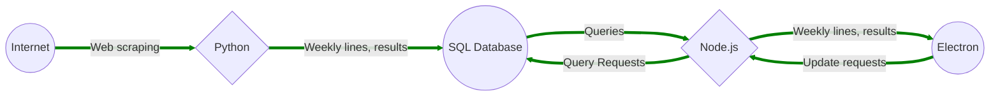

NOTE: THIS PROJECT WAS NOT ENTIRELY DEVELOPED BY ME, I HAD THE HELP OF 4 OTHER CONTRIBUTORS ON BOTH FRONTEND AND BACKEND AS CREDITED IN THE FRONTEND BRANCH. I MERGED THIS REPO TO MY PERSONAL GITHUB TO DISPLAY AS PERSONAL PROJECT WORK I HAVE ACHIEVED AS THE PREVIOUS BACKEND REPO WAS DELETED

# Sprint 2023-02-15: Project Description

## Vision
When designing ***Mainline***, our application, we had to put ourselves in our users' position. We asked ourselves, what do we have problems with when placing online sports bets? What problems have we grown accustomed to, and how can we improve on them?

The biggest problem we face when betting online, is finding the best **moneyline[^1]** odds. With so many different betting websites being created, not all **sportsbooks[^2]** can be identical. Thus, there becomes inconsistency where a bettor could have won more money if they placed the same bet on a different website. We decided to design a tool that will pull data from major online sportsbooks, and aggregate into an organized list where you, the user, can see where to place your bet.

We not only aim to improve the return on your bet, but the efficiency. Many sports bettors will have several accounts logged in on multiple tabs in their browser and will flip between tabs searching for the information they need. In our application we will not only have options to sort through these lines using filters, but it will also give users instant appraisals once their predetermined budget and bet is selected. This reduces the time spent by the bettor significantly, as many online websites hold bets in a queue in-case you were to place the bet through their site. They clearly need the additional security as their site accepts bets but here, we want to see what the user can win instantly.

Our goal is to help [legal sports gamblers](https://www.americangaming.org/research/state-gaming-map/) and enthusiasts with an issue that major market software are yet to remedy. Current options for people now include purchasing access to sportsbook APIs, to analyze raw data. Our application is much simpler and is designed to pull and organize data, so the application spans from beginner to experienced sports bettors. The application will ensure the user makes the most profitable, and safest bet based on real-time data from major sportsbooks. This safety will benefit, additionally, from "bet scores." We plan to pool our knowledge of sports to write an algorithm for computing bet quality - it will take into account the odds and past results of contestants, primarily.

## Software Architecture
Our design is based on a three-part system. The first being collecting data via **webscraping[^3]**. Here, we will use an open-source automation tool called [**Selenium IDE[^4]**](https://www.selenium.dev/selenium-ide/) in conjunction with Python code. Selenium IDE allows our program to search for different data types and elements based off the HTML code of a website when given a URL. 

From here, we will move that data into an SQL database using [**SQL Socket[^5]**](https://sqlsocket.com/) where we can store the data collected from each sportsbook URL. We will begin by collecting match history, moneyline odds, team names, etc. Then our application will take this raw data and neatly organize it based on user inputs.

Finally, we will use an application builder called [**Electron[^6]**](https://www.electronjs.org/). Electron uses a JavaScript back-end through [**Node.js[^7]**](https://nodejs.org/en/) to allow us to create a desktop application and user interface. In Node.js, we will create a REST API to interact with our SQL database. The user will log in, our Node.js API will request a query from the SQL database, and SQL will push that database through Node.js to Electron. Where we can finally format the data requested into a user interface. This loop will occur any time new data is requested by the user, while Python feeds data into the database when the application is lauched.

## Challenges and Risks
All members on this project agree the hardest part of our design will be getting each stage in our three-stage system to interact with one another. Many of us have the knowledge to do a project like this one, but we haven’t put it into practice. We are all very inexperienced when it comes to this style of project, and we recognize the additional effort that needs to be put in with something new. This may result in additional unscheduled meetings, trial and error with software, and studies unrelated to class work. 

We are trying to mitigate these challenges by focusing on setting realistic goals for the duration of our sprints. With some experience from previous co-op rotations, some of us have developed skills in areas that others have none in. During our meetings we were honest in our weaknesses, which allowed us to concentrate on delegating tasks based on where we felt comfortable. 

## List of Sportsbooks
1. [DraftKings](https://sportsbook.draftkings.com/)
2. [FanDuel](https://sportsbook.fanduel.com/)
3. [Barstool](https://www.barstoolsportsbook.com/)
4. [PointsBet](https://oh.pointsbet.com/)
5. [BetMGM](https://sports.oh.betmgm.com/)

[^1]: A bet on which team will win a game.

[^2]: An establishment that takes bets on sporting events and pays out winnings.

[^3]: The process of using bots to extract content and data from a website.

[^4]:  A  tool from the *Selenium Test Suite* and can even be used by someone new to developing automated test cases for their web applications.

[^5]: A program designed for users to input data of different data types into SQL.

[^6]: An application builder and publisher, powered by Node.js, designed for users to configure desktop application.
  
[^7]:  A cross-platform, open-source server environment with a back-end JavaScript runtime environment. Node.js runs on the V8 JavaScript Engine, and executes JavaScript code outside a web browser.
